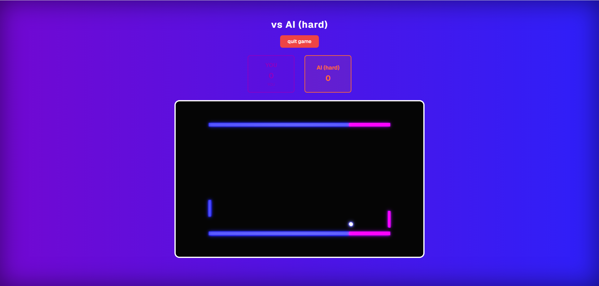
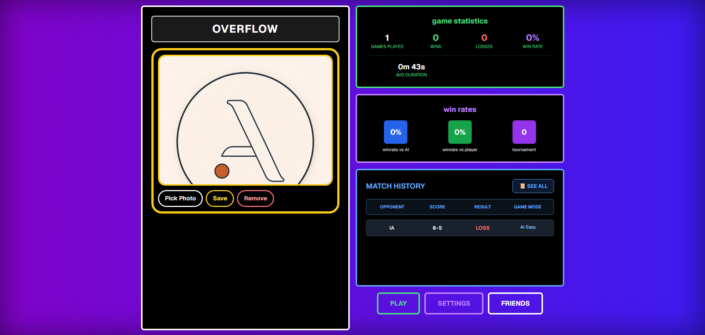
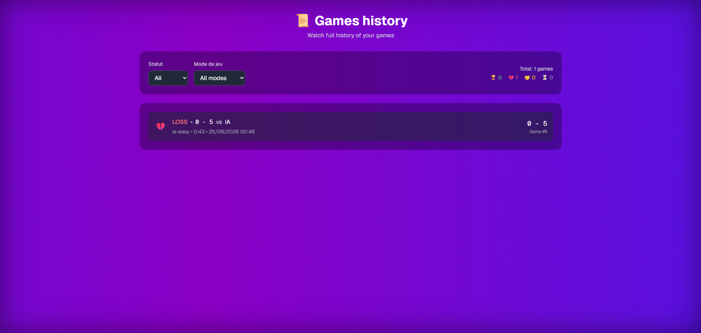

# ft_transcendence

A collaborative **full-stack web application** built as part of the 42 curriculum, centered around a Pong experience and the product features around it: authentication, profiles, friends, match history, tournaments, account security and multiple game modes.

> Portfolio version of a project developed by Florent, Younes and Topaze.

## Screenshots

### Pong gameplay

<p align="center">
  
</p>

The game supports several ways to play, including AI opponents, player-versus-player matches, local multiplayer and tournaments.

### Player profile and statistics

<p align="center">
  
</p>

Profiles bring together avatar management, game statistics, win rates, friends and recent results.

### Match history

<p align="center">
  
</p>

Completed matches are persisted by the backend and exposed through a dedicated history view with filtering by status and game mode.

## Highlights

- Next.js / React frontend written in TypeScript
- Fastify backend with SQLite persistence
- Local authentication with JWT-based sessions
- OAuth integration
- Two-factor authentication (2FA)
- User profiles, friends and match history
- Tournament flows and multiple game modes
- Pong rendering and gameplay built with Babylon.js
- Persistent game statistics and results
- Docker Compose setup for frontend and backend

## Stack

**Frontend:** Next.js 15, React 19, TypeScript, Tailwind CSS, Babylon.js  
**Backend:** Node.js, Fastify, SQLite, JWT, bcrypt  
**Infrastructure:** Docker, Docker Compose, Nginx

## Architecture

```text
transcendance/
├── frontend/        # Next.js application and game client
├── backend/         # Fastify API, authentication and persistence
└── docker-compose.yml
```

The frontend and backend run as separate services on the same Docker network. Application data and uploads are persisted through Docker volumes.

At a high level, the application combines several systems that have to remain consistent with one another:

```text
browser / UI
     │
     ├── authentication & account security
     ├── profiles / friends / statistics
     └── Pong client
             │
             ▼
        Fastify API
             │
             ├── authentication
             ├── users & social data
             ├── matches & tournaments
             └── persistent SQLite data
```

## Product scope

The Pong game is the visible center of the application, but the project is deliberately larger than the game itself.

A user can create an account, manage a profile, interact with friends, choose between several game modes, play matches and later retrieve the results through statistics and match history.

This makes ft_transcendence closer to a small complete web product than to an isolated browser game.

## Authentication and security

The application includes local authentication backed by JWT-based sessions, password hashing and two-factor authentication.

OAuth providers are also integrated in the codebase and require their own external provider credentials and callback configuration when enabled.

## Game modes

The interface exposes multiple ways to play Pong, including:

- games against AI opponents;
- player-versus-player matches;
- local multiplayer;
- tournaments.

Game results feed back into the rest of the application through match history and player statistics.

## Containerized execution

The repository contains a Docker Compose setup separating the frontend and backend into their own services.

Application data and uploaded files are stored in Docker volumes, allowing the stack to be rebuilt without treating the containers themselves as persistent storage.

## Running the project

The repository intentionally does not commit private environment files.

1. Configure the backend environment, including a `JWT_SECRET`.
2. Copy and adapt `frontend/.env.example`.
3. Add OAuth credentials only for the providers you want to enable.
4. Start the stack:

```bash
docker compose up --build
```

The frontend is exposed through HTTPS on port `8080`; the backend service listens on port `3000`.

## What this project demonstrates

ft_transcendence brings together many of the concerns explored separately in earlier projects: interfaces, API design, persistence, authentication, security, real-time game interactions, browser rendering and containerized execution.

The difficult part is not any single feature in isolation, but making all of those systems behave as **one coherent application**.

It was also a substantial collaboration exercise: responsibilities had to be split between several developers while keeping shared data, interfaces and application behavior compatible as the project evolved.

---

Part of my developer portfolio: **[github.com/Overflow-ADW](https://github.com/Overflow-ADW)**  
Professional work: **[Avenue du Web](https://avenueduweb.be)**
